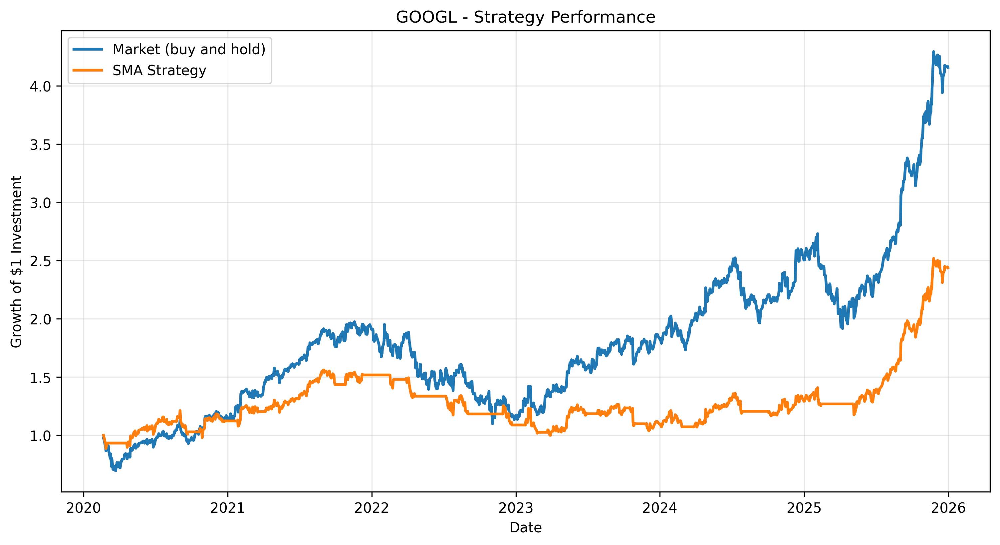
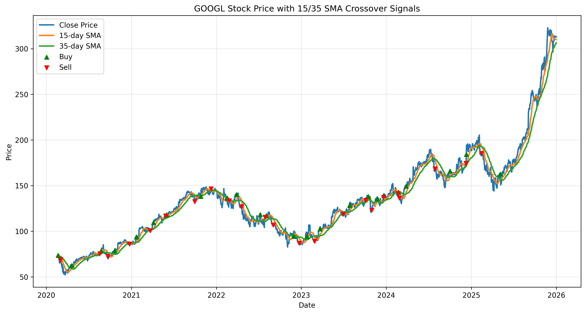
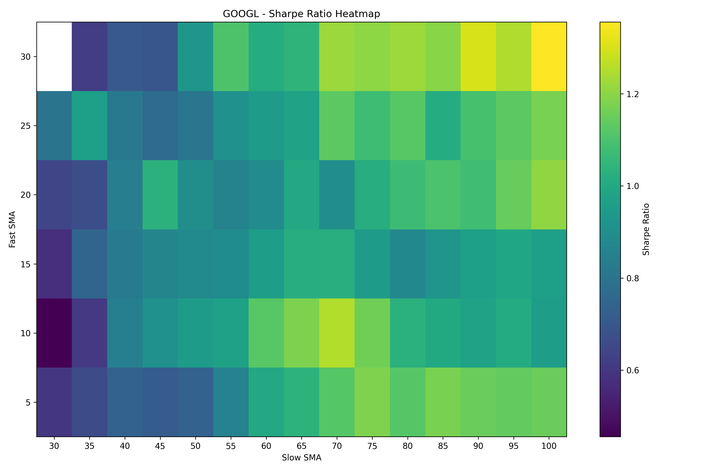

# sma-crossover-backtester
# Overview
Python backtester for a simple moving average crossover strategy using historical data.

# Features
- Downloads historical price data
- Calculates SMA indicators
- Generates buy/sell signals
- Plots and calculates cumulative strategy vs. cumulative market returns
- Plots stock price along with SMA indicator lines and buy/sell signals
- Calculates sharpe ratio
- Calculates maximum drawdown

# Technologies
- Python
- Pandas
- matplotlib
- yfinance

## Strategy Performance

## Buy/Sell Signals

## SMA Parameter Optimisation

The optimiser evaluates every fast/slow SMA combination and ranks them based on Sharpe Ratio.

A heatmap is created:

